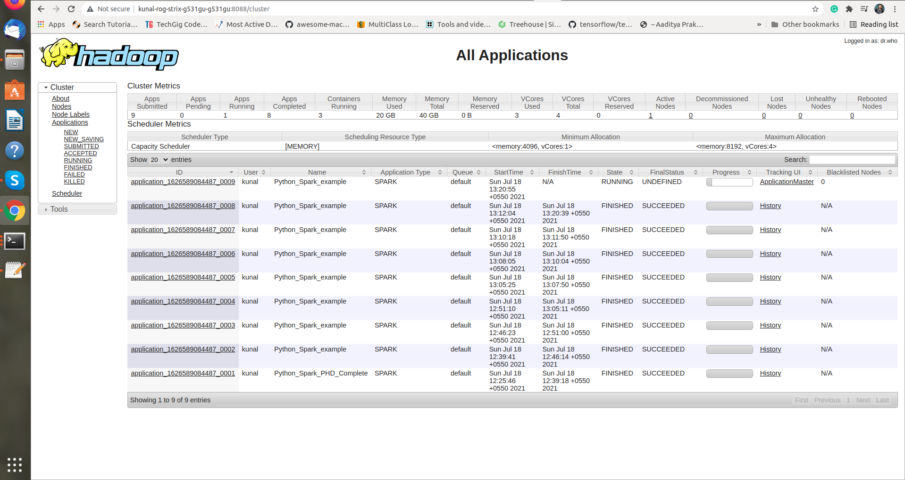
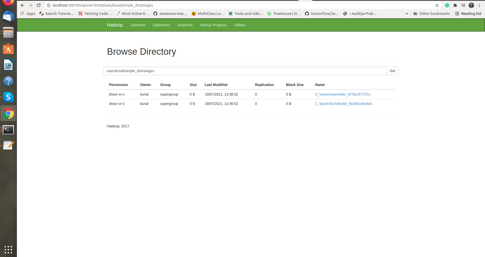
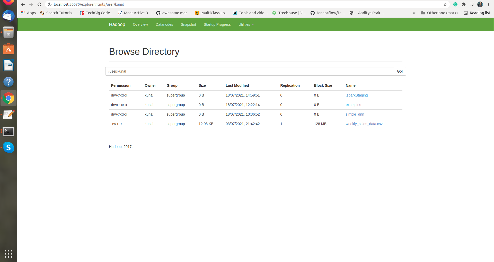

### Apache Spark with YARN example

#### YARN of SparkTorch example

    
     
    Processing SparkTorch example on YARN

#### HDFS of SparkTorch example

    
     
    Saving output on HDFS Cluster

#### Another example for Facebook prophet Time series prediction for sales data 

    
     
    Input data on HDFS cluster

#### References
- ##### [SparkTorch](https://github.com/dmmiller612/sparktorch/blob/master/examples/simple_dnn.py)

